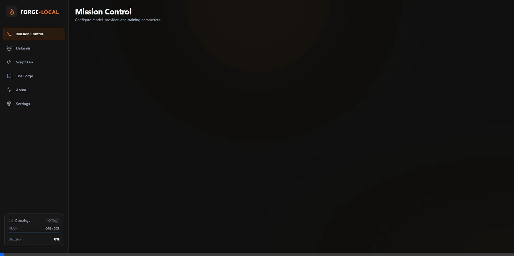

# Forge-Local 🔥

**Local-first LLM Fine-Tuning Workstation**

A tactical interface for fine-tuning language models on your local hardware using industry-standard backends like Unsloth, Axolotl, and Torchtune. Forge-Local bridges the gap between raw command-line scripts and a modern developer experience, offering real-time GPU telemetry, live loss curves, and safe VRAM pre-flight checks to ensure your training runs smoothly on consumer GPUs.



## Quick Start

```bash
# Frontend
npm install
npm run dev
# (Runs on http://localhost:3000)

# Backend (separate terminal)
cd backend
pip install -r requirements.txt
uvicorn main:app --reload --port 8001
# (Runs on http://localhost:8001)
```

Open [http://localhost:3000](http://localhost:3000)

## Features

- **Multi-Engine Orchestrator** - Switch between Unsloth, Axolotl, Torchtune
- **Script Lab** - Monaco Editor with live-synced training scripts
- **Hardware Command Center** - Real-time GPU telemetry, VRAM pre-flight checks
- **Tactical Obsidian UI** - Dark mode with safety-orange accents

## Requirements

- Node.js 18+
- Python 3.10+
- NVIDIA GPU with CUDA (recommended)
- NVIDIA Drivers (nvidia-smi)
- Training backend: `pip install unsloth` (or axolotl, torchtune)

## Project Structure

```
├── app/              # Next.js pages & API routes
├── backend/          # FastAPI Python server
├── components/       # React components
├── context/          # Global state management
├── lib/orchestrator/ # Training backend abstraction
├── models/           # Local model files
└── datasets/         # Training data (JSONL)
```

## Tech Stack

- **Frontend**: Next.js 16, React 19, Tailwind CSS, Framer Motion
- **Backend**: FastAPI, WebSocket streaming
- **Training**: Unsloth, Axolotl, Torchtune
